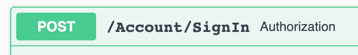
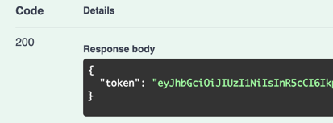
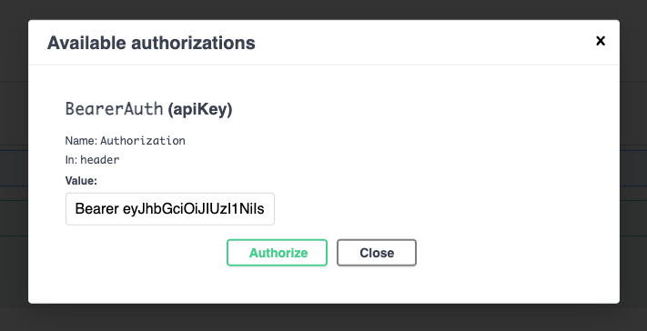

<h1 style="text-align: center;"> REST API golang server for Simbir.GO project </h1>

- [Установка](#установка)
    - [Конфигурация сервера](#конфигурация-сервера)
    - [Конфигурация базы данных](#конфигурация-базы-данных)
    - [Запуск .go пакета (рекомендуется)](#запуск-go-пакета)
    - [Docker](#docker)
- [Использование](#использование)
    - [Swagger](#swagger)
    - [Аутентификация](#аутентификация)
- [Изменения](#изменения)

# Установка

## Конфигурация сервера
Для корректного запуска корневой каталог обязан иметь файл `.env.local` со следующим содержанием:
```
POSTGRES_USER={пользователь_базы_данных}
POSTGRES_PASSWORD={пароль_пользователя_базы_данных}
JWT_KEY={jwt_секретный_ключ}
```
Также необходимо настроить файл конфигурации `configs/config.json`:
```json
{
  "postgres": {
    "host": "ip_адрес_базы_данных",
    "port": "port_базы_данных",
    "DBName": "имя_базы_данных",
    "SSLMode": "disable"
  },
  "server": {
    "port": "порт_на_котором_будет_запущен_сервер"
  }
}
```

## Конфигурация базы данных
Выполнить скрипт инициализации схемы базы данных из файла `queries/schema.sql` и скрипт базовых значений `migrations/init_values.sql`.

## Запуск go пакета
Загрузить необходимые модули:
```
go mod tidy
```
Запустить пакет:
```
go run cmd/main.go
```

## Docker
Собрать образ сервера:
```
make docker_api_build
```
Собрать образ базы данных:
```
make docker_postgres_build
```
Запуск docker compose:
```
docker compose up
```

В случае отсутствия `make` запустить соответсвующие команды в файле `Makefile`.


# Использование

## Swagger
При запуске из исходников сервер будет слушать порт, указанный в `configs/config.json`, из под Docker Compose - `8080`.
Swagger доступен по адресу:
```
http://localhost:{порт_сервера}/swagger/index.html
```
## Аутентификация
Аутентификация происходит по адресу `/Account/SignIn`
<p align="center">

</p>

1. Получить jwt токен
<p align="center">

</p>
2. Отрыть окно для вставки заголовка авторизации
<p align="center">

</p>
3. Вставить токен авторизации в формате `Bearer {token}`
<p align="center">

</p>

# Изменения
* При поиске транспорта радиус указывается в метрах.
